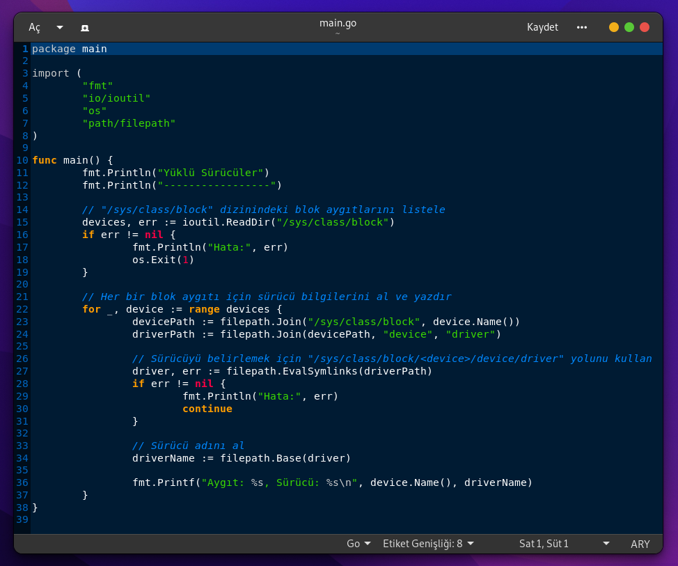

<a href="https://github.com/pedromxavier/flag-badges">
    
</a>

# drivershowing
this code allows you to view your installed drivers written in GO language

Install Git Clone and Go

Github Package Must Be Installed On Your Device.
```bash
sudo apt install git -y

```

GO Package Must Be Installed On Your Device.
```bash
sudo wget https://go.dev/dl/go1.20.5.linux-amd64.tar.gz
tar -xvf go1.20.5.linux-amd64.tar.gz
```

----------------------------------
# Installation
Install cleaning
```bash
sudo git clone ttps://github.com/cektor/drivershowing.git)
```
```bash
cd drivershowing/
```

```bash
go build main.go
./main
```


# Screenshot

 
